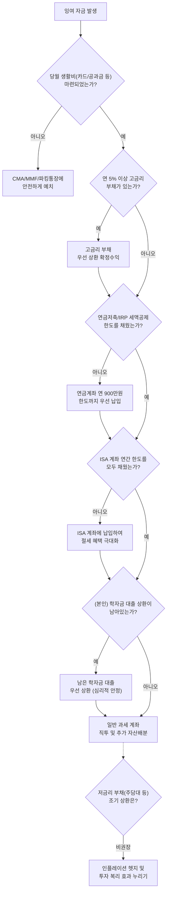

# 📋 투자 계획 수립 (Investment Planning)

투자의 첫걸음은 무작정 어떤 주식을 살지 고르는 것이 아닙니다. 존 보글과 보글헤드 커뮤니티는 본격적인 투자에 앞서 흔들리지 않는 **나만의 투자 정책서(IPS, Investment Policy Statement)**를 명문화하는 것을 가장 중요한 원칙으로 삼습니다.

다음은 보글헤드 커뮤니티가 권장하는 '투자 계획 수립의 5단계 가이드'를 한국 투자자의 실정에 맞게 재구성한 내용입니다.

---

## 1. 스스로 학습하라 (Educate yourself)

가장 먼저 해야 할 일은 금융의 기본 원리를 스스로 깨우치는 것입니다. 
누군가(은행 창구 직원, 증권사 프라이빗 뱅커, 유튜브 전문가 등)에게 내 자산의 미래를 위탁하는 순간, 그들의 '수수료'가 나의 '복리 수익'을 갉아먹게 됩니다.

* **자립심 갖기**: 금융 산업은 복잡성을 팔아 돈을 법니다. 투자의 진리는 생각보다 매우 단순하며, 개인 투자자 누구나 스스로 훌륭한 포트폴리오를 운용할 수 있다는 확신을 가져야 합니다.
* **고전 읽기**: 유행하는 재테크 서적이 아닌, 시간을 견뎌낸 고전들을 통해 뼈대를 세워야 합니다. 존 보글의 《모든 주식을 소유하라》, 테일러 라리모어의 《보글헤드 투자 가이드》 등이 좋은 출발점입니다.

## 2. 투자 계획 수립 (Investment Plan)

배를 띄우기 전, 목적지와 항해 기간을 명확히 정해야 합니다. 이 과정이 문서로 정리된 것이 바로 **투자 정책서(IPS)**입니다.

* **재무 목표 설정**: 자금의 성격(결혼 자금, 주택 마련, 노후 연금 등)에 따라 투자 기간(Time Horizon)이 완전히 달라집니다. 3년 내에 쓸 돈이라면 주식에 투자해서는 안 됩니다.
* **현금흐름 통제**: 지출을 통제하여 수입보다 덜 쓰고, 저축률을 높이는 것이 모든 투자의 엔진입니다. 
* **생활비(비상금) 확보**: 당월 결제될 카드대금, 아파트 관리비, 공과금, 통신비, 식비 등 필수 생활비를 CMA나 파킹통장에 현금으로 분리해 둡니다. 이는 당장의 현금흐름 꼬임을 막고 복리로 굴러가는 주식을 헐값에 매도하는 참사를 막아주는 1차 방어막입니다.

## 3. 자산 배분 (Asset Allocation)

> [!IMPORTANT]
> **"자산 배분이 포트폴리오 장기 수익률의 90% 이상을 결정한다."**

개별 종목(삼성전자냐 애플이냐)이나 매수 타이밍보다 압도적으로 중요한 것이 바로 '주식과 채권/현금의 비율'을 정하는 일입니다.

* **위험 수용 능력(Ability)과 필요성(Need)**: 나이, 직업의 안정성, 은퇴까지 남은 기간을 고려하여 내가 얼마나 위험을 감당할 수 있는지(Ability) 파악해야 합니다. 또한, 목표 달성을 위해 주식의 높은 변동성을 굳이 감수할 필요(Need)가 있는지도 따져봐야 합니다.
* **단순한 룰**: 나이만큼 안전 자산(채권)을 보유하라는 고전적인 룰부터, '120 - 나이 = 주식 비중' 이라는 공격적인 룰까지 다양합니다. 핵심은 폭락장이 왔을 때 내가 공포에 질려 다 팔아버리지 않을 만큼만의 주식 비중을 설정하는 것입니다.

## 4. 포트폴리오 구성 (Portfolio Construction)

자산 배분(주식 70% : 채권 30%)이 끝났다면, 이제 빈칸을 어떤 상품으로 채울지 결정합니다.

* **광범위하고 단순하게**: 한국 주식, 미국 주식, 신흥국 주식 등을 복잡하게 쪼개기보다, 전 세계 자본주의 전체에 투자하는 광범위한 마켓 인덱스 ETF(예: VOO, VTI, KOSPI 200 등)를 활용합니다.
* **저비용 인덱스 펀드 위주**: 수수료(TER)가 낮고 구조가 투명한 인덱스 펀드로 뼈대(Core)를 구성합니다. 인간 매니저의 주관이 개입된 액티브 펀드나 유행하는 테마형 ETF는 최대한 배제합니다.
* **유지보수의 최소화**: 포트폴리오는 구성하는 것보다 유지하는 것이 더 어렵습니다. 복잡한 포트폴리오는 결국 관리 실패로 이어지므로, 1년에 한 번 정해진 비율대로 리밸런싱만 하면 되는 '초단순 구조'를 지향합니다.

## 5. 투자 자금의 우선순위 (Investing Priority)

매월 잉여 자금이 생겼을 때, 어느 바구니(계좌)부터 채워야 세금과 이자를 가장 효율적으로 아낄 수 있는지 순서를 정하는 것은 매우 중요합니다. 보글헤드 철학에서는 이를 직관적인 의사결정 트리(Flowchart)로 표현합니다.

### Figure 1. Bogleheads 오리지널 투자 우선순위
미국의 세제 혜택(401k, HSA, IRA 등)과 학자금 저축(529), 주택담보대출(Mortgage) 등을 기준으로 설계된 오리지널 모델입니다.

### Figure 2. 한국형 투자 우선순위 (Korean Localized)
오리지널의 철학(비상금 -> 고금리 빚 상환 -> 세제혜택 극대화 -> 학자금 -> 주담대 vs 일반 투자)을 한국 실정(3대 절세계좌, 학자금, 주택담보대출)에 맞추어 완벽하게 현지화한 순서도입니다.

#### 우선순위별 핵심 전략
1. **당월 생활비 계좌(CMA/MMF/파킹통장)**: 가장 먼저 당월 결제될 카드대금, 아파트 관리비, 공과금, 통신비, 식비 등 필수 생활비를 CMA/MMF/파킹통장에 현금으로 확보합니다. 이는 투자에 자금이 묶여 일상생활에 필수적인 현금흐름이 막히는 상황을 방지하기 위한 최소한의 안전장치입니다.
2. **고금리 부채 상환**: 연 5% 이상의 이자를 내는 대출이 있다면, 가장 확실한 확정 수익률은 대출을 갚는 것입니다.
3. **연금저축펀드 및 IRP (세액공제용)**: 연말정산 세액공제 혜택(연 최대 900만 원)은 국가가 주는 가장 확실하고 거대한 보너스입니다. 노후 자금이라면 최우선으로 한도를 채웁니다.
4. **ISA (개인종합자산관리계좌)**: 중단기 목적 자금 및 국내 상장 해외 ETF 투자 시, 과세 이연과 분리 과세 혜택을 극대화할 수 있는 필수 절세 계좌입니다.
5. **(본인) 학자금 대출 상환**: Bogleheads 오리지널의 529 Plan(자녀 학자금 저축)에 대한 한국형 대안입니다. 자녀 학자금은 자녀 스스로 해결하도록 독립성을 존중하고, 대신 본인에게 남은 학자금 대출이 있다면 이를 상환하여 심리적/재무적 독립을 완성합니다.
6. **일반 과세 계좌 (직투) 및 저금리 부채(주담대)의 철학**: 모든 절세 계좌를 채우고 남은 자금은 일반 계좌에서 투자합니다. 이때 **주택담보대출과 같은 저금리 장기 부채는 조기 상환하지 않는 것**이 보글헤드의 수학적 정석입니다. 장기 투자의 기대 수익률이 대출 이자보다 높으며, 시간이 지날수록 **인플레이션이 부채의 실질 가치를 녹여버리기 때문**입니다. 빚을 갚는 대신 시장에 머물며 복리를 취하십시오.

---

## 📖 참고 문헌 (References)
본 가이드는 보글헤드 커뮤니티의 검증된 투자 계획 수립 프로세스를 바탕으로 작성되었습니다. 원문은 아래 링크에서 확인할 수 있습니다.
* 🔗 [Bogleheads Wiki: Prioritizing investments](https://www.bogleheads.org/wiki/Prioritizing_investments)
* 🔗 [Bogleheads Forum: Asking Portfolio Questions & Investment Planning (viewtopic.php?t=6211)](https://www.bogleheads.org/forum/viewtopic.php?t=6211)

[👉 다시 투자 철학 메인(보글헤드 10대 원칙)으로 돌아가기](./bogleheads.md)
