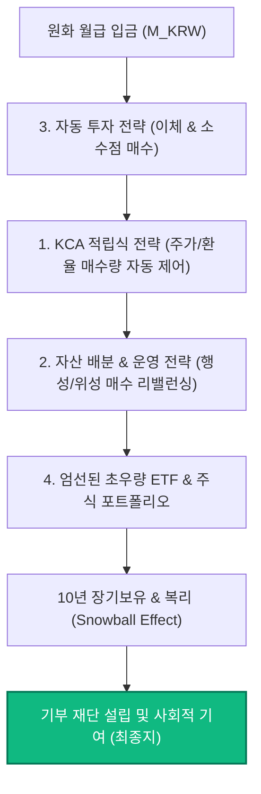

# 🪐 나의 투자 전략 (Investment Strategy)

성공적인 장기 투자의 핵심은 일관된 규칙과 감정의 배제입니다. 저의 투자 전략은 시장의 일시적인 출렁임(마켓 타이밍)을 예측하려 노력하기보다, 기계적인 시스템을 구축하여 복리의 힘을 누리고 장기 생존하는 데 목적이 있습니다. 

저의 투자 프로세스는 아래와 같은 **4개의 핵심 기둥(Pillars)**을 바탕으로 설계되어 실행됩니다.

---

## 🏛️ 투자 전략의 4대 핵심 기둥

  <!-- Pillar 1 -->
  

    

      
🪐

      <h3 style="margin-top: 0; font-size: 1.25rem; font-weight: 600; color: var(--vp-c-brand-1);">1. KCA 적립식 전략</h3>
      

        원화 고정 금액 매입(KRW Cost Averaging)을 공식화하여 주가와 환율의 역상관성을 포트폴리오에 반영합니다. 고환율 시 고가 매수를 방지하고 저환율 시 매집을 극대화합니다.
      

    

    

      <a href="/strategy/kca" style="font-size: 0.9rem; font-weight: 600; color: var(--vp-c-brand-1); text-decoration: none; display: inline-flex; align-items: center;">
        자세히 보기 →
      </a>
    

  

  <!-- Pillar 2 -->
  

    

      
⚖️

      <h3 style="margin-top: 0; font-size: 1.25rem; font-weight: 600; color: var(--vp-c-brand-1);">2. 자산 배분 & 운영 전략</h3>
      

        자산의 비중을 조절하는 핵심 행성(인덱스 ETF)과 주변 위성(개별 주식) 모델을 구축하고, 자산을 매매하여 조절하는 대신 매월 현금 투입 비율을 다르게 설정하는 '매수 리밸런싱'을 실천합니다.
      

    

    

      <a href="/strategy/allocation" style="font-size: 0.9rem; font-weight: 600; color: var(--vp-c-brand-1); text-decoration: none; display: inline-flex; align-items: center;">
        자세히 보기 →
      </a>
    

  

  <!-- Pillar 3 -->
  

    

      
🤖

      <h3 style="margin-top: 0; font-size: 1.25rem; font-weight: 600; color: var(--vp-c-brand-1);">3. 자동 투자 전략</h3>
      

        시장의 실시간 등락에 흔들리는 나약한 인간의 의지를 배제하고, 예약 이체, 소수점 자동 투자, 자동 환전 시스템을 조합해 '알아서 굴러가는' 완전 자동화 시스템을 셋팅합니다.
      

    

    

      <a href="/strategy/auto-investment" style="font-size: 0.9rem; font-weight: 600; color: var(--vp-c-brand-1); text-decoration: none; display: inline-flex; align-items: center;">
        자세히 보기 →
      </a>
    

  

  <!-- Pillar 4 -->
  

    

      
🔍

      <h3 style="margin-top: 0; font-size: 1.25rem; font-weight: 600; color: var(--vp-c-brand-1);">4. ETF 선정 및 도구 가이드</h3>
      

        시가총액, 수수료, 운용사 규모 등 장기 생존할 우량 주식과 ETF를 직접 비교 선별하는 핵심 조건들과 리서치에 활용하는 전문 모바일 앱 및 분석 웹사이트 가이드를 공유합니다.
      

    

    

      <a href="/strategy/how-to-choose" style="font-size: 0.9rem; font-weight: 600; color: var(--vp-c-brand-1); text-decoration: none; display: inline-flex; align-items: center;">
        자세히 보기 →
      </a>
    

  

---

## 🧭 실천 로드맵: 10년 뒤 눈덩이(Snowball)를 굴리는 법

나의 투자 전략은 상호 유기적으로 작동하여 최종 목표를 달성하도록 돕습니다.

이 프로세스를 통해 일상의 평화와 본업의 생산성을 극대화하며, 단기 시장 소음에 휩쓸리지 않고 안전하게 **장기 복리 구간(Snowballing)**으로 진입하는 구조를 완성합니다.

각 탭을 이동하여 구체적이고 체계적인 실행 방법을 확인해 보세요.
